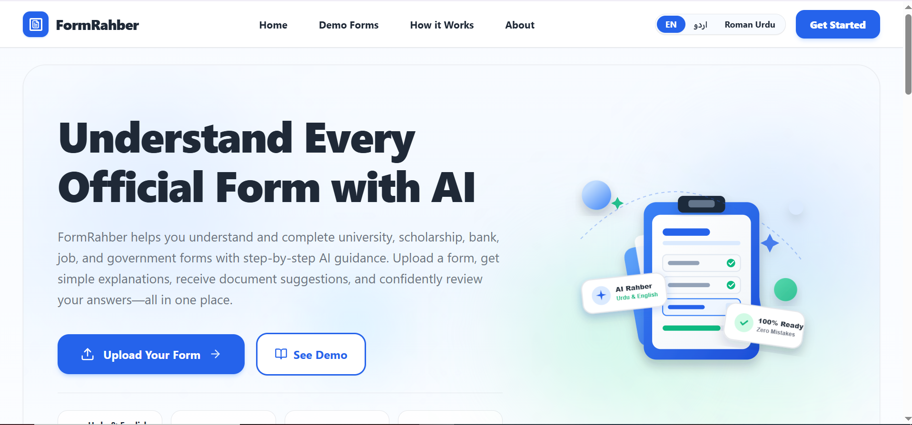
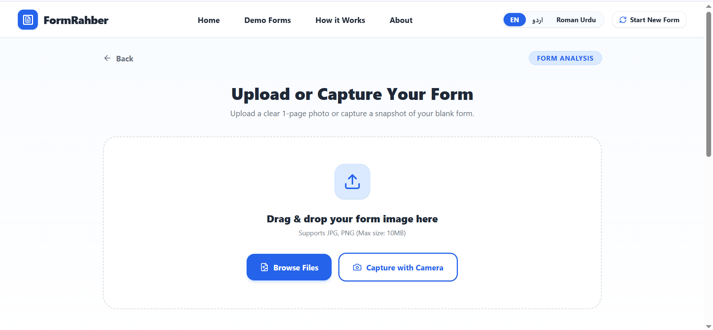
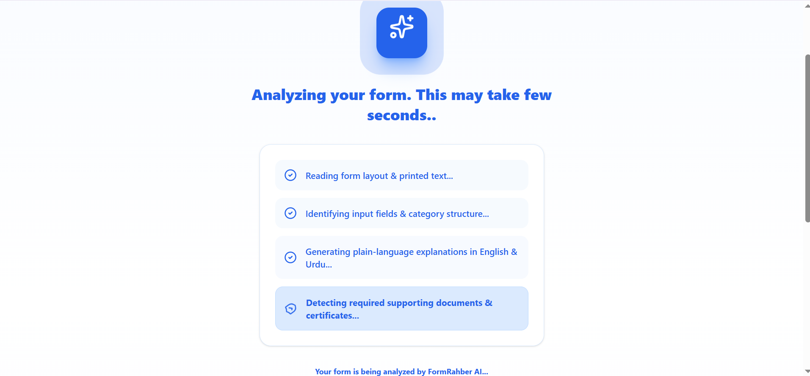
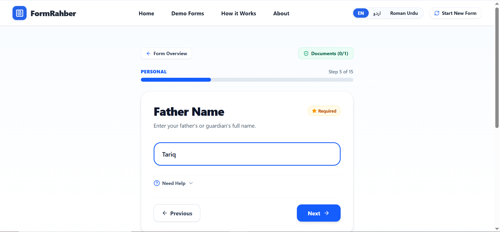
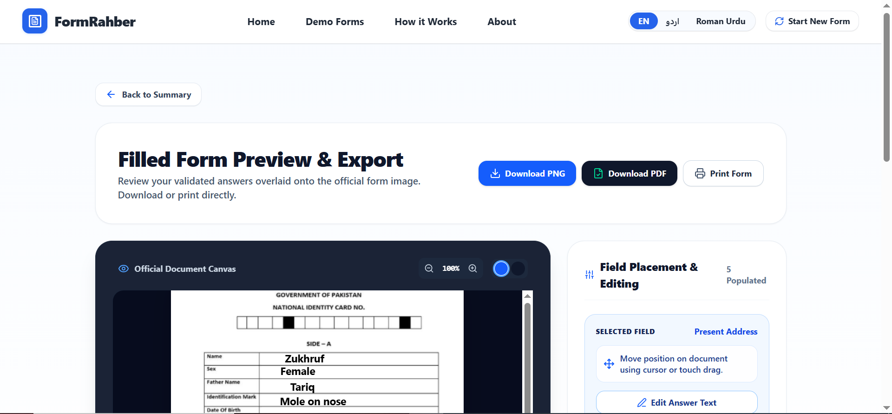

# FormRahber (فارم رہبر) 📄🤖

### AI-Powered Official Form Assistant

[](https://form-rahber.vercel.app/)
[](https://react.dev/)
[](https://www.typescriptlang.org/)
[](https://tailwindcss.com/)
[](https://ai.google.dev/)

---

# 🌍 Live Demo

**Website:** https://form-rahber.vercel.app/

**GitHub Repository:** https://github.com/ZukhrufMuntaha/FormRahber

---

# 📖 About FormRahber

FormRahber is an AI-powered web application that helps users understand and complete confusing official forms. Instead of struggling with difficult terminology and complicated instructions, users simply upload a photo of a form and receive AI-generated explanations, document suggestions, and guided assistance in English, Urdu, or Roman Urdu.

The application supports common forms such as:

- 🎓 University Admission Forms
- 🏦 Bank Account Opening Forms
- 🪪 CNIC / NADRA Forms
- 📄 Government Forms
- 💼 Job Application Forms
- 🎓 Scholarship Forms

---

# ❗ Problem Statement

Many people struggle to complete official forms because they contain confusing language, unfamiliar terminology, and unclear document requirements.

This often leads to:

- Incorrect submissions
- Missing required documents
- Multiple visits to offices
- Dependence on paid form-filling agents
- Difficulties for elderly and low-literacy users

FormRahber solves this problem using Artificial Intelligence by explaining forms in simple language and guiding users step by step.

---

# 👥 Target Users

- Students
- Parents
- Scholarship applicants
- First-time bank customers
- Job seekers
- Citizens completing government forms
- Elderly users
- Low-literacy users

---

# ✨ Features

- 📄 Upload official forms
- 🤖 AI-powered form analysis
- 🌐 English, Urdu & Roman Urdu support
- 🔍 Automatic field detection
- 📚 Plain-language explanations
- 📋 Smart document checklist
- 🧠 AI guided form filling
- 🖱 Interactive drag-and-drop field placement
- 📥 Download completed form as PDF/Image
- 📱 Mobile responsive interface
- 🎓 Sample forms for testing
- 🚫 Detects unsupported images

---

# 🤖 AI Feature

FormRahber uses Google's Gemini Vision model to analyze uploaded forms.

The AI automatically:

- Reads English and Urdu forms
- Detects every visible field
- Explains difficult terminology
- Identifies required documents
- Guides users while filling forms
- Detects non-form images
- Generates structured JSON for the application

---

# 🧠 AI System Prompt

The AI was instructed with a custom system prompt similar to the following:

```text
You are an AI assistant specialized in official forms.

Your responsibilities:

• Detect every visible field.
• Never invent fields.
• Read English, Urdu, and mixed-language forms.
• Explain every field in simple language.
• Suggest required supporting documents.
• Return valid structured JSON.
• If the uploaded image is not an official form, politely reject it.
• Never guess uncertain information.
```

---

# 🛠 Technologies Used

### Frontend

- React 19
- TypeScript
- Tailwind CSS v4
- Vite

### Backend

- Express.js
- Node.js

### AI

- Google Gemini 2.5 Flash
- Google GenAI SDK

### Other Libraries

- jsPDF
- Lucide React
- Motion
- Web Speech API

### Deployment

- Vercel

### Version Control

- GitHub

---

# 📸 Screenshots

## Landing Page

> Add screenshot here



---

## Upload Form

> Add screenshot here



---

## AI Analysis

> Add screenshot here



---

## Guided Filling

> Add screenshot here



---

## Export Filled Form

> Add screenshot here



---

# 🚀 How to Run

Clone the repository

```bash
git clone https://github.com/ZukhrufMuntaha/FormRahber.git
```

Move into the project

```bash
cd FormRahber
```

Install dependencies

```bash
npm install
```

Create a `.env` file

```env
GEMINI_API_KEY=YOUR_GEMINI_API_KEY
```

Run the development server

```bash
npm run dev
```

---

# 🌐 Deployment

This project is deployed on **Vercel**.

Deployment Steps:

1. Push the project to GitHub.
2. Import the repository into Vercel.
3. Add:

```
GEMINI_API_KEY
```

under Environment Variables.

4. Deploy.

Live URL:

https://form-rahber.vercel.app/

---

# 🔒 Privacy & Security

- Images are processed only for AI analysis.
- No permanent user database is used.
- API keys are stored securely using environment variables.
- Sensitive credentials are never committed to GitHub.

---

# 🚀 Future Improvements

- Multi-page form support
- Voice input
- User accounts
- Save previous forms
- More language support
- Digital signatures
- OCR improvements

---

# 🙏 Acknowledgements

- Google Gemini AI
- React
- Tailwind CSS
- Vercel
- Lucide Icons
- jsPDF

---

# 📄 License

This project is licensed under the MIT License.

---

# 👨‍💻 Developer

**Developed by Zukhruf Muntaha**

Final Project — AI Application Development

2026

Made with ❤️ using React, TypeScript and Google Gemini AI.